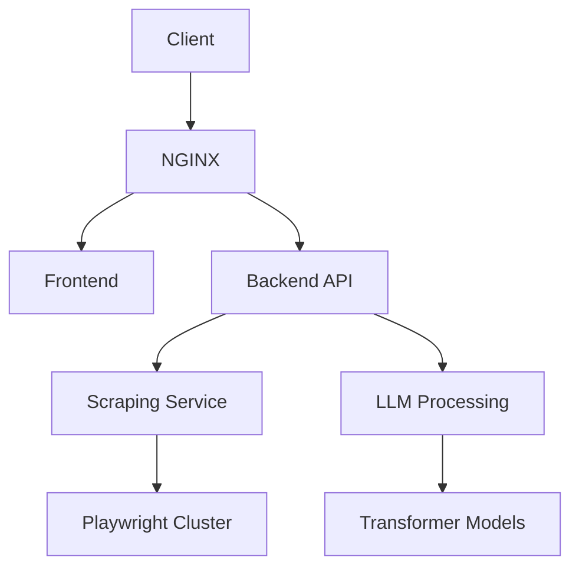

# Crawl4AI Scraper Application Documentation

## Overview
A dockerized web scraping solution that extracts content to markdown, captures screenshots, and applies LLM-powered extraction strategies.

## Technology Stack
### Core Components
- **Python 3.9+** (Backend services)
- **FastAPI** (REST API endpoints)
- **Playwright** (Headless browser automation)
- **Docker** (Containerization)
- **Docker Compose** (Orchestration)

### AI/ML Components
- **LLMExtractionStrategy** (Content analysis via language models)
- **Transformers** (NLP processing)

### Frontend
- **React** (UI components)
- **TypeScript** (Frontend implementation)
- **Material-UI** (UI components)

## Application Architecture
### Key Services


### Data Flow
1. URL submission through React UI
2. API request routing via FastAPI
3. Playwright-based content acquisition
4. Markdown transformation & screenshot capture
5. LLM-powered content analysis
6. Result aggregation and response

## Coding Standards
### Backend (Python)
- PEP8 compliance enforced via pre-commit
- Type hints for all public methods
- Async-first implementation
- Pytest coverage > 80%

### Frontend (TypeScript)
- Strict null checks
- Functional components with hooks
- Atomic design pattern
- Cypress E2E testing

## Dockerization
### Service Architecture
```yaml
version: '3.8'
services:
  backend:
    build: ./docker/backend
    env_file: .env
  frontend:
    build: ./docker/frontend
    ports:
      - "3000:3000"
  playwright:
    image: mcr.microsoft.com/playwright
```

### Build Process
- Multi-stage Dockerfiles
- Slim Python base images
- Node.js 16.x for frontend
- Production-optimized builds

## Getting Started
### Prerequisites
```bash
docker-compose build
docker-compose up -d
```

### Environment Setup
```bash
# Windows
./setup.ps1

# Unix
chmod +x setup.sh
./setup.sh
```

## Assumptions & Constraints
1. Docker runtime available
2. NVIDIA GPU for LLM acceleration (optional)
3. Minimum 8GB RAM allocation
4. Network access to target domains
5. Valid API keys in .env file

## Contribution Guidelines
1. Feature branches from `develop`
2. Conventional commits
3. Draft PRs for WIP
4. Codeowner reviews required
5. Update integration tests

# Project Setup Guide

## Pre-commit Hook Configuration

### Overview
The project uses pre-commit hooks to ensure code quality and consistency. These hooks run automatically before each commit and check for:
- Code formatting (black)
- Import sorting (isort)
- Style and docstring compliance (flake8)

### Setup Process

1. **Configuration File**
   Create `.pre-commit-config.yaml` in the project root:
   ```yaml
   repos:
   -   repo: https://github.com/psf/black
       rev: 23.12.1
       hooks:
       -   id: black
           language_version: python3.11
           args: ['--line-length=79', '--skip-string-normalization', '--preview']

   -   repo: https://github.com/pycqa/flake8
       rev: 7.0.0
       hooks:
       -   id: flake8
           args: [
               '--ignore=D100,D400,D401,E501,F401',
               '--max-line-length=79'
           ]
           additional_dependencies: [flake8-docstrings]

   -   repo: https://github.com/pycqa/isort
       rev: 5.13.2
       hooks:
       -   id: isort
           args: ["--profile", "black", "--line-length=79"]
   ```

2. **Development Dependencies**
   Add the following to `requirements.txt`:
   ```
   # Development dependencies
   pre-commit>=3.6.0
   black==23.12.1
   flake8>=7.0.0
   flake8-docstrings>=1.7.0
   isort>=5.13.2
   ```

3. **Installation**
   ```bash
   # Install pre-commit and dependencies
   pip install -r requirements.txt
   
   # Install the git hooks
   pre-commit install
   ```

### Hook Details

1. **Black (Code Formatter)**
   - Line length: 79 characters
   - Skip string normalization (preserves single/double quotes)
   - Preview mode enabled for latest features
   - Automatically formats code to meet Python style guidelines

2. **Flake8 (Style Checker)**
   - Checks PEP 8 compliance
   - Validates docstrings (using flake8-docstrings)
   - Ignores specific rules:
     - D100: Missing module docstring
     - D400: First line should end with period
     - D401: First line should be in imperative mood
     - E501: Line too long
     - F401: Imported but unused

3. **isort (Import Sorter)**
   - Uses black-compatible settings
   - Line length: 79 characters
   - Groups and sorts imports according to PEP 8

### Usage

1. **Automatic Checks**
   - Hooks run automatically on `git commit`
   - Failed checks prevent commit until issues are fixed
   - Some issues are fixed automatically (formatting, import sorting)
   - Others require manual fixes (docstrings, style violations)

2. **Manual Running**
   ```bash
   # Check all files in the project
   pre-commit run --all-files
   
   # Check specific files
   pre-commit run --files path/to/file1.py path/to/file2.py
   ```

3. **Example Output**
   ```
   black....................................................................Passed
   flake8...................................................................Failed
   - hook id: flake8
   - exit code: 1
   crawl4ai_scraper/test_hooks.py:8:1: D403 First word of the first line should be properly capitalized
   isort....................................................................Passed
   ```

### Common Issues and Solutions

1. **Docstring Formatting**
   ```python
   # Incorrect
   def function():
       """this is incorrect.
       no blank line after summary.
       """
   
   # Correct
   def function():
       """This is correct.

       Has a capitalized first word and
       a blank line after the summary.
       """
   ```

2. **Import Organization**
   ```python
   # Incorrect
   import sys,os,json
   from typing import List,Dict
   
   # Correct (after isort)
   import json
   import os
   import sys
   from typing import Dict, List
   ```

3. **Code Formatting**
   ```python
   # Incorrect
   def bad_function(x,y,z='test'):return {'x':x,'y':y,'z':z}
   
   # Correct (after black)
   def good_function(
       x: int,
       y: int,
       z: str = 'test'
   ) -> Dict[str, Any]:
       return {'x': x, 'y': y, 'z': z}
   ```

### Bypassing Hooks
In rare cases where you need to bypass the hooks:
```bash
# Skip all pre-commit hooks
git commit -m "message" --no-verify

# Skip specific hooks
SKIP=flake8 git commit -m "message"
```

Note: Bypassing hooks should be done sparingly and with good reason.
